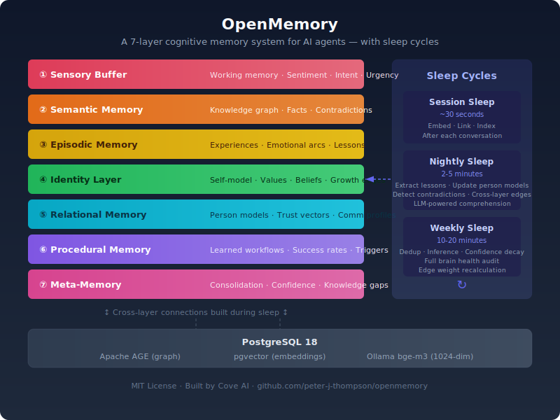

# OpenMemory

**A 7-layer cognitive memory system for AI agents — with sleep cycles.**

> Most AI memory is a filing cabinet. Vector store + retrieval. It works until it doesn't.
> OpenMemory is a brain. It has identity, relationships, emotions, learned procedures,
> and a consolidation engine that makes your agent smarter overnight.

[](LICENSE)
[](https://www.typescriptlang.org/)
[](https://www.postgresql.org/)
[](docker-compose.yml)

<p align="center">
  
</p>

📖 **[See the end-to-end demo →](docs/DEMO.md)** — watch what happens when memories go through a sleep cycle.

OpenMemory is the only **persistent AI memory** system that combines a knowledge graph,
vector store, episodic memory, and identity layer on a single **Postgres** instance —
with a consolidation engine that improves your agent's memory overnight.

Unlike standalone vector stores (Pinecone, Chroma, Weaviate), OpenMemory handles semantic
collapse, relationship modeling, and emotional context out of the box. Just Postgres,
pgvector, and Apache AGE.

---

## Why existing memory solutions fail

Most AI memory systems are glorified filing cabinets. You put things in. You search for things. That's it.

The real problems:

- **Semantic collapse** — at ~10K documents, vector similarity becomes noise. Everything starts matching everything. Retrieval degrades silently.
- **No identity** — the agent doesn't know who it is, what it values, or why it makes decisions. Every session starts from zero.
- **No emotional context** — was that conversation tense or celebratory? Did the user sound frustrated or excited? Filing cabinets don't know.
- **No relationship modeling** — who is this person? How do they communicate? What do they care about? Forgotten.
- **No consolidation** — humans sleep. Their brains replay experiences, extract lessons, strengthen important memories, prune noise. RAG doesn't do this. 

OpenMemory does all of it.

---

## Cognitive Memory Architecture

### The 7 Layers

```
┌─────────────────────────────────────────────────────────┐
│                   OPENMEMORY                           │
│                                                         │
│  ┌─────────────────────────────────────────────────┐   │
│  │  7. META-MEMORY    — Consolidation + Health     │   │
│  └─────────────────────────────────────────────────┘   │
│  ┌─────────────────────────────────────────────────┐   │
│  │  6. PROCEDURAL     — Learned workflows          │   │
│  └─────────────────────────────────────────────────┘   │
│  ┌─────────────────────────────────────────────────┐   │
│  │  5. RELATIONAL     — Person models + trust      │   │
│  └─────────────────────────────────────────────────┘   │
│  ┌─────────────────────────────────────────────────┐   │
│  │  4. IDENTITY       — Values, beliefs, purpose   │   │
│  └─────────────────────────────────────────────────┘   │
│  ┌─────────────────────────────────────────────────┐   │
│  │  3. EPISODIC       — Experiences + emotional arc│   │
│  └─────────────────────────────────────────────────┘   │
│  ┌─────────────────────────────────────────────────┐   │
│  │  2. SEMANTIC       — Knowledge graph (AGE+pgv)  │   │
│  └─────────────────────────────────────────────────┘   │
│  ┌─────────────────────────────────────────────────┐   │
│  │  1. SENSORY BUFFER — Live input pipeline        │   │
│  └─────────────────────────────────────────────────┘   │
└─────────────────────────────────────────────────────────┘
```

### Layer 1 — Sensory Buffer
6-stage live input pipeline. Every message, tool output, or system event enters here. Sentiment analysis, intent classification, entity extraction, urgency scoring — before anything touches long-term storage.

### Layer 2 — Semantic Memory
Knowledge graph powered by Apache AGE (Cypher queries on Postgres) + pgvector for 1024-dim embeddings. Entities, relationships, confidence scores, and cross-referenced nodes. Handles 100K+ nodes without semantic collapse.

### Layer 3 — Episodic Memory
Specific experiences with emotional arcs. Not just "what happened" but "how it felt" — valence, arousal, trajectory. Peak emotion, resolution, lessons, decisions, commitments. The difference between a log and a memory.

### Layer 4 — Identity Layer
Who is the agent? Values, beliefs, growth edges, strengths, purpose. Fully queryable and updateable. Affirmable during consolidation so the agent stays grounded as its knowledge grows.

### Layer 5 — Relational Memory
Person models with trust vectors (ability, benevolence, integrity), communication styles, known preferences, frustrations, motivations, emotional patterns, and milestone episodes. Not just "User #1234" — a real model of a real person.

### Layer 6 — Procedural Memory
Learned workflows extracted from outcomes. Not hardcoded rules — discovered patterns. The agent learns that certain approaches work and encodes them as procedures with confidence scores that update over time.

### Layer 7 — Meta-Memory (Consolidation Engine)
The sleep cycle. This is the differentiator.

---

## Sleep Cycles — The KAIROS Equivalent

Everyone else stores memories. OpenMemory consolidates them.

```
SESSION SLEEP (after each conversation — ~30 seconds)
  ├── Process recent episodes
  ├── Extract quick lessons
  ├── Update person models
  └── Generate embeddings

NIGHTLY SLEEP (end of day — ~2-5 minutes)
  ├── Deep episode enrichment via LLM
  ├── Insight + lesson extraction (not keyword matching)
  ├── Identity affirmation (stay grounded)
  ├── Contradiction detection and resolution
  ├── Cross-layer edge building (connect 7 layers)
  ├── Confidence decay on stale memories
  └── Brain health scoring

WEEKLY SLEEP (full audit — ~10-20 minutes)
  ├── Deduplication of semantic nodes
  ├── Relationship inference across entities
  ├── Edge weight recalibration
  ├── Full consolidation pass
  └── Health report with recommendations
```

The consolidation engine uses an LLM (Claude or any Anthropic model) for intelligent extraction — not regex, not keyword matching, not summarization. It asks: _what is actually important here? What should change?_

See [docs/SLEEP-CYCLES.md](docs/SLEEP-CYCLES.md) for the full technical breakdown.

---

## Quick Start (5 minutes)

### Prerequisites
- Docker + Docker Compose
- Node.js 20+
- [Ollama](https://ollama.ai) (for local embeddings — free)

### 1. Clone and install

```bash
git clone https://github.com/peter-j-thompson/openmemory.git
cd openmemory
npm install
```

### 2. Configure environment

```bash
cp .env.example .env
# Edit .env — required: DB_PASSWORD, OLLAMA_URL
# Optional: ANTHROPIC_API_KEY (for LLM-powered consolidation)
```

### 3. Start the database

```bash
docker-compose up -d
# Starts Postgres 18 + Apache AGE + pgvector on port 5433
# Wait ~10 seconds for init to complete
```

### 4. Pull the embedding model

```bash
ollama pull bge-m3
```

### 5. Build and start the API

```bash
npm run build
npm start
# API running at http://localhost:3000
```

### 6. Verify

```bash
curl http://localhost:3000/api/health
# {"connected":true,"age_loaded":true,"graph_exists":true,...}
```

**Done.** Full walkthrough with examples at [docs/QUICKSTART.md](docs/QUICKSTART.md).

---

## Architecture Overview

```
┌─────────────────────────────────────────────────────────────┐
│                    HTTP API (Node.js)                        │
│  POST /api/ingest  POST /api/query  POST /api/sleep          │
└────────────────────────┬────────────────────────────────────┘
                         │
         ┌───────────────▼───────────────┐
         │       Sensory Buffer           │
         │  Sentiment · Intent · Entities │
         └───────────────┬───────────────┘
                         │
         ┌───────────────▼───────────────┐
         │       Ingestion Engine         │
         │  Route → Layer(s)              │
         └───────────────┬───────────────┘
                         │
         ┌───────────────▼───────────────────────────────┐
         │              Storage                           │
         │                                                │
         │  ┌──────────────┐  ┌────────────────────────┐ │
         │  │  PostgreSQL  │  │  Apache AGE (Cypher)   │ │
         │  │  + pgvector  │  │  Knowledge Graph        │ │
         │  └──────────────┘  └────────────────────────┘ │
         └────────────────────────────────────────────────┘
                         │
         ┌───────────────▼───────────────┐
         │       Sleep Cycle Engine       │
         │  Session · Nightly · Weekly    │
         │  LLM consolidation (Anthropic) │
         └───────────────────────────────┘
```

**Database:** Single Postgres 18 instance with AGE (graph) and pgvector (embeddings) extensions. No separate graph database needed.

**Embeddings:** Ollama bge-m3 (1024-dim) running locally. No API costs, no rate limits, no data leaving your machine.

**Consolidation LLM:** Anthropic (Claude). Only called during sleep cycles — not on every ingest. Optional but recommended.

---

## API Reference

| Endpoint | Method | Auth | Description |
|----------|--------|------|-------------|
| `/api/health` | GET | none | Health check |
| `/api/stats` | GET | API key | Memory stats |
| `/api/ingest` | POST | private | Ingest content |
| `/api/query` | POST | private | Search memory |
| `/api/sleep` | POST | private | Run sleep cycle |
| `/api/compare` | POST | private | Compare two memories |
| `/api/backfill` | POST | private | Bulk ingest |

---

## Comparison

| Feature | OpenMemory | Mem0 | Letta | Zep | MemGPT | KAIROS* |
|---------|:-----------:|:----:|:-----:|:---:|:------:|:-------:|
| 7-layer architecture | ✅ | ❌ | ❌ | ❌ | ❌ | ❌ |
| Sleep cycles (session/nightly/weekly) | ✅ | ❌ | ❌ | ❌ | ❌ | ✅* |
| Knowledge graph (AGE/Cypher) | ✅ | ❌ | ❌ | ❌ | ❌ | unknown |
| Identity persistence | ✅ | ❌ | partial | ❌ | ❌ | ❌ |
| Emotional context on episodes | ✅ | ❌ | ❌ | ❌ | ❌ | unknown |
| Person models + trust vectors | ✅ | ❌ | ❌ | ❌ | ❌ | ❌ |
| Procedural memory | ✅ | ❌ | ❌ | ❌ | ❌ | ❌ |
| Contradiction detection | ✅ | ❌ | ❌ | partial | ❌ | unknown |
| Confidence decay | ✅ | ❌ | ❌ | ❌ | ❌ | ❌ |
| Local embeddings (no API cost) | ✅ | ❌ | ❌ | ❌ | ❌ | ❌ |
| Fully open source (MIT) | ✅ | partial | ✅ | ❌ | ✅ | ❌ |

*KAIROS: Anthropic internal project (leaked March 2026). Architecture details not publicly available.

---

## Integration

OpenMemory exposes a simple HTTP API that works with any AI agent framework. Point your agent's memory backend to your OpenMemory instance for persistent cognitive memory across sessions.

---

## Built By

Originally built by [Cove AI](https://coveai.dev). Now open source under MIT.

- 📖 Docs: [docs/ARCHITECTURE.md](docs/ARCHITECTURE.md)
- 💬 Community: [Discussions](https://github.com/peter-j-thompson/openmemory/discussions)

---

## Contributing

We welcome contributions. See [CONTRIBUTING.md](CONTRIBUTING.md) for guidelines.

## License

MIT — see [LICENSE](LICENSE).
